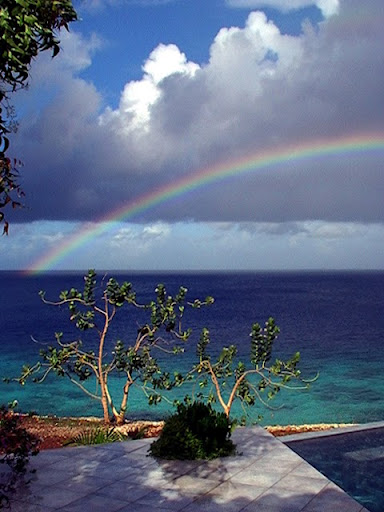

# Where We Live

<table border="0">
<tr>
<td></td>
<td align=right valign=bottom></td>
</tr>
</table>

Bonaire, formerly of the Netherlands Antilles, as of 10-10-10, the Dutch Caribbean

.notes: Blennylips Youtube Channel - Blennlips Picasa Web Albums